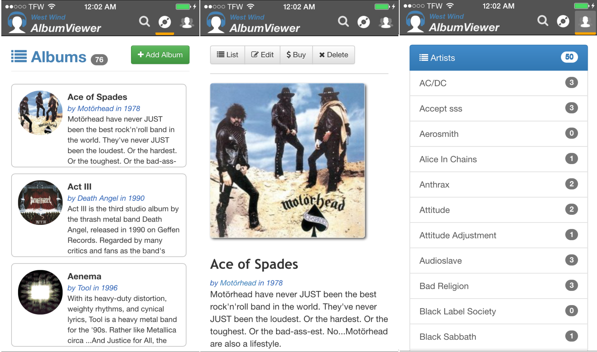
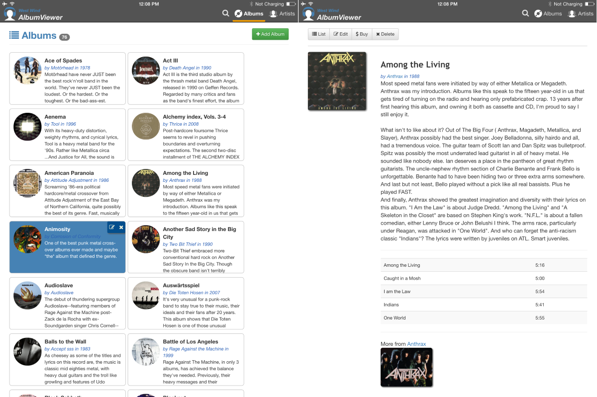

# Cordova Album Viewer Sample

This project is a sample application for the following CODE Magazine article:

**Taming Mobile Apps with Cordova and Visual Studio** (not out yet)

and blog post:

**[Using Cordova and Visual Studio to build iOS Mobile Apps](http://weblog.west-wind.com/posts/2015/Jan/06/Using-Cordova-and-Visual-Studio-to-build-iOS-Mobile-Apps)**

The sample application is a small Album Viewer that lets you browse and edit a number of music albums interactively. Data is local and on device only to make it easy to run the app and play without without having to configure external services.

### Sample Alert

Note this is a sample application that was ported over from another app. There are a few features that are enabled in the UI, but that do not actually work properly at the moment: